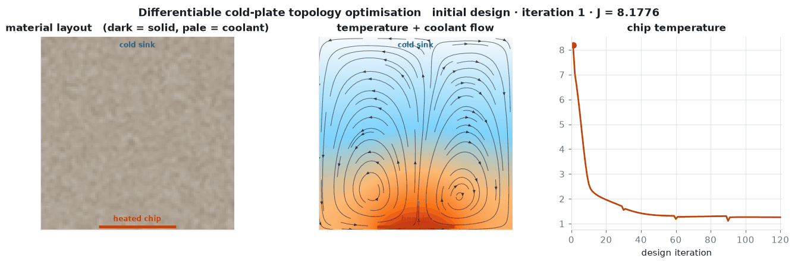
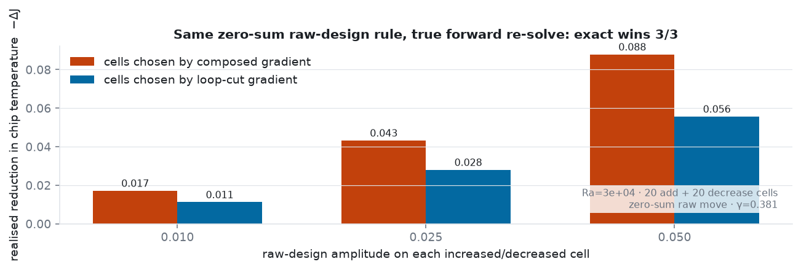
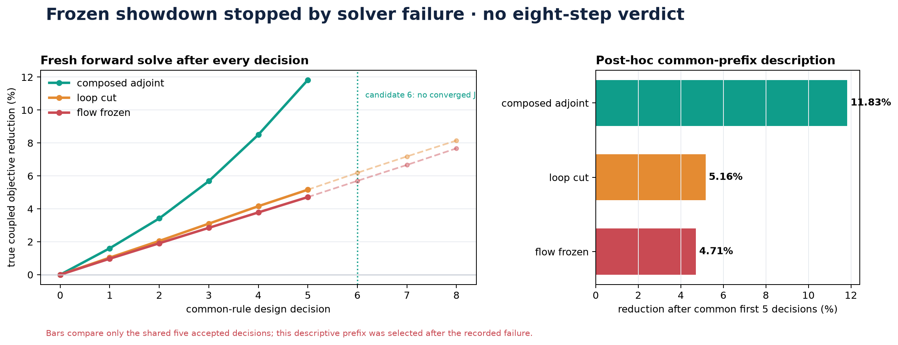
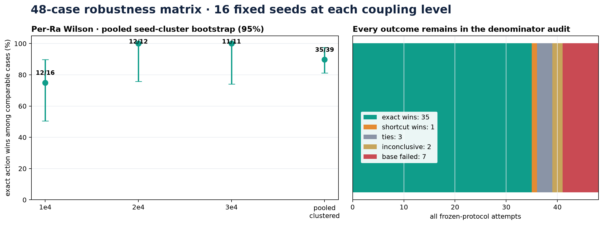
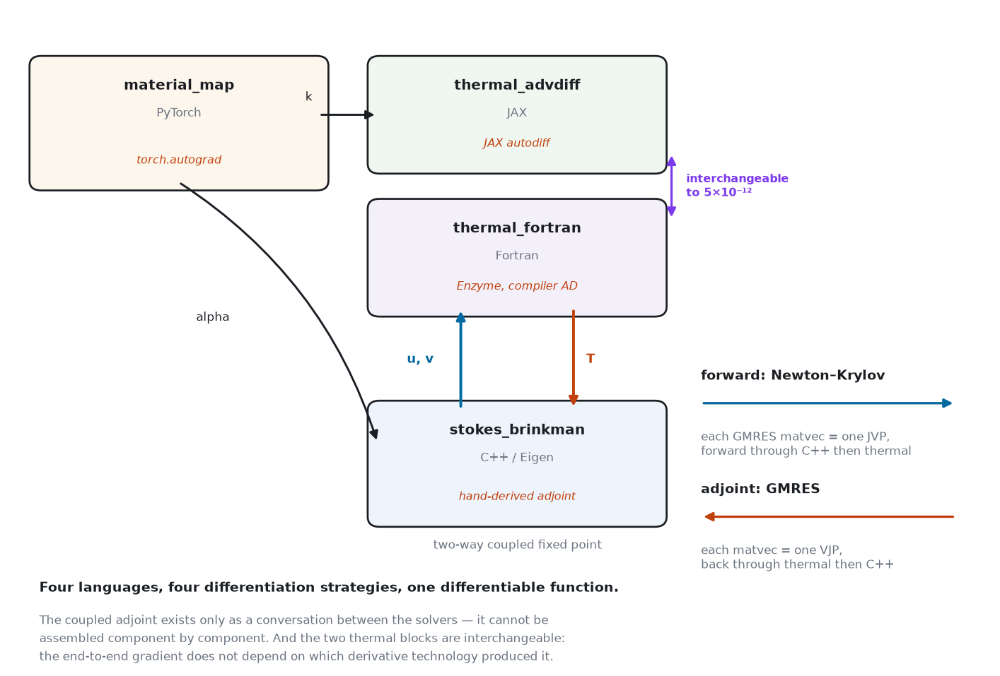

# Coldplate

**Track: Multi-physics & coupled systems · Apache-2.0 · solo entry**

**One `jax.grad` that crosses three languages, four derivative stacks and a
two-way physics loop — and the loop is the part everyone else drops.**

A natural-convection cold plate, differentiated end to end across three served
Tesseracts: a PyTorch material map feeds a C++/Eigen fluid solver that is
coupled **in both directions** to a thermal solver. The thermal slot accepts
either JAX autodiff or an independently written Fortran implementation
differentiated by **Enzyme at the LLVM IR level**. Temperature drives the flow
through buoyancy, the flow drives temperature through advection, so the steady
state is a fixed point and its gradient is an implicit-function-theorem adjoint
whose every matvec crosses the container boundary.

> **The result in one line.** Cutting that loop — the shortcut a competent
> engineer writes when the fluid solver hands out no derivatives — leaves a
> gradient that is **86% wrong with a third of the signs inverted**, and
> nothing in the forward solution says so. Asked to place the same fixed
> zero-sum design action, the coupling-complete gradient buys **58% more
> realised cooling** when the true coupled solver re-scores both choices.

| Watch | Read | Run | Browse |
| --- | --- | --- | --- |
| [4:51 narrated demo](demo/coldplate_submission.mp4) ([captions](demo/coldplate_submission.en.srt)) | [4-page technical paper](PAPER.pdf) | [`bash scripts/judge_demo.sh`](scripts/judge_demo.sh) — 1–3 min warm | [results page](docs/index.html) · [figures](#figures) |



## Thirty-second result

| proof | measured result |
| --- | --- |
| Swap JAX autodiff for Fortran/Enzyme | end-to-end gradient changes by **5.3 × 10⁻¹²**, cosine 1.000000000000 |
| Validate the composed adjoint | directional derivative matches a true coupled finite difference to **8.3 × 10⁻⁶** |
| Act on the sensitivities at strong coupling | under the same zero-sum raw-design rule, the exact-gradient action gives **58% more realised cooling**; a retrospectively frozen 48-attempt extension records **35 exact wins, 1 shortcut win, 3 ties and 9 noncomparable attempts**—35/39 wins among comparable cases, with an **81.1%** post-freeze descriptive seed-cluster-bootstrap lower endpoint |
| Screen the shortcut for one VJP | normalized adjoint residual `γ = ‖Φ_Tᵀg‖/‖g‖`; 14 converged cases give log-correlation **0.995**, leave-one-family-out 0.994–0.997 |

The exact and loop-cut gradients can both drive the weakly coupled long
optimisation, which is why convergence alone is not validation. At a strongly
coupled state the shortcut is 86% wrong and flips a third of the signs; when it
chooses where to apply a fixed raw-design action, the true forward solver confirms
that the composed sensitivity makes the better engineering decision.

**Who this is for.** Anyone standing in front of a coupled pipeline deciding
whether to build the coupled adjoint or just differentiate the components
separately — conjugate heat transfer, fluid–structure interaction,
reservoir–geomechanics, any two solvers that feed each other. That call is
usually made on intuition, because the forward solution looks healthy either
way. This repository measures what the shortcut actually costs on one such
problem, shows that the obvious diagnostic (the loop gain ρ) is *not*
sufficient, and ships the one-VJP screen that works better, as a module you can
point at your own loop: [`fixed_point_adjoint.py`](fixed_point_adjoint.py) takes
any JAX-traceable `phi`, knows nothing about cold plates, and refuses to return
a verdict until you give it thresholds calibrated on your own application.

## Reading this repository on a budget

| you have | do this | you will have seen |
| --- | --- | --- |
| **2 minutes** | the table above, then the [results page](docs/index.html) | every headline number beside the file that produced it |
| **5 minutes** | the [4:51 video](demo/coldplate_submission.mp4) | the loop, the backend swap, the decision, and the failures we kept |
| **15 minutes** | the [4-page paper](PAPER.pdf), then [*The claim*](#the-claim) and [*Why this needs Tesseract*](#why-this-needs-tesseract) | the argument, and the objection we expect a reviewer to raise |
| **30 minutes, a shell** | [`bash scripts/judge_demo.sh`](scripts/judge_demo.sh) | both thermal backends served in containers, agreeing to 10⁻¹² end to end |
| **an afternoon** | [*Reproduce*](#reproduce) | any table in this file, regenerated from source |

**Map of the argument.** [The claim](#the-claim) states what is being compared ·
[the decision](#the-gradient-changes-a-realised-engineering-decision) shows the
gradient changing a physical outcome · [what we do *not* claim](#what-we-do-not-claim)
is where the naive gradient wins, and why that is not a defence ·
[γ](#what-actually-predicts-it-one-vjp) is the one-VJP screen that predicts the
damage, [tested off this problem entirely](#does-γ-generalise-past-this-cold-plate-2377-random-systems-say-yes--with-one-boundary) ·
[architecture](#architecture) and [why this needs Tesseract](#why-this-needs-tesseract)
cover the composition · [engineering contributions](#engineering-contributions)
is what outlives this cold plate, and what the build refuses to take on trust ·
[validation](#validation) is the numerical evidence ·
[prior work](#prior-work-and-what-is-actually-new-here) says plainly what is not
new here.

---
## The claim

The two physics blocks are coupled in both directions. Buoyancy makes
temperature drive the flow; advection makes the flow drive temperature. The
steady state is therefore a fixed point, not a feed-forward chain:

```
T* = Phi(T*, theta),    Phi = thermal( fluid(T) )
```

If the fluid component cannot hand you derivatives — common for a legacy or
closed-source solver — a cheap shortcut is to freeze the velocity field and
differentiate the thermal block alone. External finite differences, complex
steps or surrogates could estimate the missing derivative at additional cost;
here we measure the consequence of omitting it.

We compare three gradients against central finite differences on the fully
converged coupled solve. Two are naive, and the second is the one a competent
engineer would actually write:

- **composed adjoint** — implicit differentiation of the fixed point (this work);
- **one-way** — uses the C++ solver's derivatives in full and differentiates the
  entire chain `rho → alpha → (u,v) → T`, but treats the temperature entering
  buoyancy as constant. Everything is exact *except* that it ignores the loop;
- **frozen-flow** — the velocity field held constant, representing the case
  where no fluid derivative is supplied or estimated externally.

Measured through the real Tesseracts at Ra = 3×10⁴ (see `validate_pipeline.py`;
numbers reproduced by the script, not quoted from a notebook):

| gradient | rel. error | cosine vs true | design variables with the wrong sign |
| --- | --- | --- | --- |
| **composed adjoint** | **8.3 × 10⁻⁶** | 1.0000 | 0% |
| one-way (naive) | 0.856 | +0.53 | **33%** |
| frozen-flow (naive) | 0.831 | +0.56 | **27%** |

The composed figure is a directional derivative along a random unit vector,
agreeing with central differences to 8.3 × 10⁻⁶ and holding at ~10⁻⁵ across
step sizes from 10⁻³ to 10⁻⁴ — that plateau *is* the finite-difference noise
floor, since the fixed point is only converged to ~10⁻¹⁰. The
coupling-complete adjoint differentiates the converged discrete equations,
while the residual discrepancy is consistent with the finite-difference and
forward-solve tolerances.

**Every number in that table reproduces through either thermal backend**
(`scripts/validate_both_backends.sh`), which is worth stating because the two
share no derivative machinery:

| | JAX autodiff | Fortran + Enzyme |
| --- | --- | --- |
| J | 2.626343 | 2.626343 |
| analytic ⟨g, d⟩ | 3.5227189491 × 10⁻² | 3.5227189484 × 10⁻² |
| directional rel. error | 7.45 × 10⁻⁶ | 7.10 × 10⁻⁶ |
| one-way naive | 0.856, cos 0.5335, 33% | 0.856, cos 0.5335, 33% |
| frozen-flow naive | 0.831, cos 0.5604, 27% | 0.831, cos 0.5604, 27% |

Agreement to nine or ten significant figures, and the compiler-differentiated
path is 3.7× faster here (2.9 s vs 10.7 s) — the sparse operator costs nine
Enzyme JVPs, against a JAX trace per parameter derivative.

The naive gradients carry **~85% relative error and point the wrong way on a
third of all design variables** — despite the one-way version using the C++
solver's adjoint in full and getting everything right except the feedback loop.
Cutting that loop is not a small approximation: it is most of the gradient.

### The gradient changes a realised engineering decision

Correctness matters only if acting on it changes the physical outcome. At a
strongly coupled state (`N=20`, Ra = 3×10⁴), each gradient was given the same
raw-design rule: increase the 5% of variables it calls most beneficial,
decrease the 5% it calls least beneficial by the same amplitude, and make the
raw move sum to zero. We then ignored both predictions and re-solved the true
coupled forward problem (`intervention_test.py`):

| raw-design amplitude per selected cell | ΔJ, cells chosen by exact gradient | ΔJ, cells chosen by loop-cut gradient | extra realised cooling |
| ---: | ---: | ---: | ---: |
| 0.010 | −0.01715 | −0.01121 | 53% |
| 0.025 | −0.04322 | −0.02800 | 54% |
| 0.050 | **−0.08789** | −0.05565 | **58%** |

Both actions use 20 raw-variable increases and 20 decreases with a zero-sum raw
move. Filtering and projection are nonlinear, so this is not a claim of equal
realised physical-density movement. The composed-gradient action wins all three
forward re-solves. At the largest amplitude it selects a change that cools
**58% more** under the same raw-variable count and amplitude.
This is the missing link between gradient accuracy and an engineering outcome.



Then we held `Ra=2×10⁴` and the `0.025` action fixed and repeated the true
forward re-solve over the fixed contiguous seed range 0 through 11
(`intervention_robustness.py`):

| seed | γ | naive rel. err | ΔJ, composed choice | ΔJ, loop-cut choice | extra cooling |
| ---: | ---: | ---: | ---: | ---: | ---: |
| 0 | — | — | *base solver did not converge within its budget* | | |
| 1 | 0.330 | 0.859 | −0.04927 | −0.03925 | 26% |
| 2 | 0.369 | 0.744 | −0.06034 | −0.04202 | 44% |
| 3 | 0.215 | 0.332 | −0.05143 | −0.04873 | 6% |
| 4 | 0.201 | 1.122 | **−0.12222** | −0.03252 | **276%** |
| 5 | 0.366 | 1.010 | −0.04758 | −0.03728 | 28% |
| 6 | — | — | *exact-action solve did not converge; comparison inconclusive* | | |
| 7 | 0.360 | 0.713 | **−0.11281** | −0.03024 | **273%** |
| 8 | 0.375 | 0.864 | −0.04577 | −0.03811 | 20% |
| 9 | 0.194 | 0.345 | −0.06203 | −0.05268 | 18% |
| 10 | 0.359 | 0.710 | **−0.10077** | −0.02789 | **261%** |
| 11 | 0.478 | 1.212 | −0.05243 | −0.02328 | 125% |

The sweep produced **10 wins and 0 observed losses** for the composed choice
among the ten designs for which both actions could be compared, with a median
of **36% extra cooling** and a range of 6% to 276%. The other **2 inconclusive attempts**
are seed 0's base solve, which did not converge within the numerical
budget, while the earlier runner stopped seed 6 after the exact-action solve
failed and therefore never evaluated the shortcut action. Solver failure is
reported as solver failure; it is not evidence that an equilibrium does not
exist.

That structure is deliberate, and it replaced an earlier version of this
experiment that was not sound. The first version took a hand-picked seed list
and *raised an exception* whenever the exact gradient lost — so a design that
disagreed would have crashed the run instead of appearing in the table. A test
that cannot record a negative is not evidence. The current driver fixes a
contiguous range, records losses as losses, evaluates the two actions
independently, and reports failed or incomplete comparisons instead of turning
them into wins.

γ was between 0.194 and 0.478 on every comparable design — **UNSAFE on all of
them**, which is the correct call: the loop-cut gradient carried 33% to 121%
relative error there.

### Frozen extensions: a solver boundary and 48 attempts

We specified two follow-ups in committed protocols before storing their
trajectories, but call them **retrospectively frozen designs**, not prospective
preregistrations. The operating points were informed by the favourable result
above. In particular, 13 of the 48 matrix cells had prior stored evidence; 35
had no stored result when the design was frozen. The protocols and every
contrary outcome remain in the repository.

The repeated strong-coupling showdown gave all three branches the same initial
design, raw-design proposal rule, projected-volume target, eight update
opportunities and true candidate-forward budget. The composed branch accepted
five decisions, reducing the true objective by **11.83%**, but its proposed
sixth candidate did not converge within the frozen solver budget (residual
`1.07e-2`). The loop-cut and frozen-flow branches completed eight decisions,
reducing their objectives by **8.15%** and **7.67%**, respectively. This is an
**incomplete** execution: because the horizons differ, the eight-step endpoint
is **not evaluable** and there is **no eight-step endpoint verdict**.

For **post-hoc descriptive context only**, the shared first five accepted decisions reduce
the objective by **11.83%** with the composed adjoint, **5.16%** with the
loop-cut gradient and **4.71%** with frozen flow. That common-prefix comparison
was examined after the failure; it is not the frozen endpoint and is not called
a win.



The 48-attempt matrix completed every planned `(Ra, seed)` cell and retained
base-solver failures, incomplete action pairs, ties and the one shortcut win:

| Ra | exact wins | shortcut wins | ties | noncomparable |
| ---: | ---: | ---: | ---: | ---: |
| 10,000 | 12 | **1** | 3 | 0 |
| 20,000 | 12 | 0 | 0 | 4 |
| 30,000 | 11 | 0 | 0 | 5 |
| **pooled** | **35** | **1** | **3** | **9** |

Thus **35 of 39 comparable cases (89.7%)** favour the exact-gradient action;
the attempt-level Wilson interval is 76.4–95.9%. Because each seed appears at
all three Rayleigh numbers, the secondary seed-cluster bootstrap resamples the
16 complete seed clusters rather than pretending all 48 attempts are
independent. This is a post-freeze descriptive interval, not a frozen primary
inferential endpoint: its 95% span is 81.1–97.4%, so the quoted lower endpoint
is **81.1%**.

The provenance split is deliberately visible. The 13 prior-overlap cells
contain 11 exact wins and 2 noncomparable attempts. Among the **35** cells not
stored before the frozen design, there are **24 exact wins, 1 shortcut win, 3
ties and 7 noncomparable attempts**—24/28 wins among comparable cases. This is a strong
robustness extension, not an untouched independent confirmation set.



Every extension is byte-bound in
[`EVIDENCE_PROVENANCE.json`](orchestrator/results/EVIDENCE_PROVENANCE.json).
The validator requires all four canonical records, rehashes the 48-attempt
tree, queries the original Actions run/artifact metadata, downloads each
artifact, and compares its bytes with the committed evidence:

| retained evidence | Actions outcome | source | interpretation |
| --- | --- | --- | --- |
| 48-attempt matrix | [success](https://github.com/TAUIL-Abd-Elilah/coldplate/actions/runs/31826817492) | `3c3d8fb` | complete, including contrary outcomes |
| eight-step showdown | [expected failure](https://github.com/TAUIL-Abd-Elilah/coldplate/actions/runs/31826895893) | `cd7900e` | incomplete endpoint; no winner |
| nonlinear/SI physics | [workflow success](https://github.com/TAUIL-Abd-Elilah/coldplate/actions/runs/31826056516) | `429661d` | cavity valid; dimensional evidence invalid |
| showdown interpretation | deterministic derivation | `interpret_showdown.py` | input/output hashes bound |

```bash
python scripts/validate_evidence_provenance.py --verify-github
```

### What we do *not* claim

We ran the full topology optimisation twice — once driven by the composed
gradient, once by the naive one, same seed and schedule — and **both succeeded**:

| driven by | final J | reduction |
| --- | --- | --- |
| coupling-complete gradient | 1.2588 | 84.6% |
| one-way gradient (naive) | 1.2576 | 84.6% |

The naive run ended a hair *lower*. We are not going to dress that up. An
optimiser is not evidence that a gradient is right. (This replicates: at 48×48
the same pair came out 1.2677 vs 1.2374.)

The reason is measurable. Tracking the naive gradient's error at the designs
the optimiser actually visits (`--diagnose`, 96×96):

| iteration | J | loop gain | naive error | cosine | wrong sign |
| --- | --- | --- | --- | --- | --- |
| 1 | 8.18 | 0.759 | 6.3% | 0.9983 | 0% |
| 12 | 2.31 | 0.428 | 20.1% | 0.9867 | 2% |
| 60 | 1.19 | 0.640 | 7.6% | 0.9973 | 1% |
| 120 | 1.26 | 0.587 | 4.1% | 0.9996 | 1% |

Along this trajectory the naive gradient is only **4–20% off, with a cosine
above 0.98 and almost no sign errors**. It is a perfectly serviceable search
direction here, and the optimisation result above is exactly what you would
expect from that. No mystery.

The interesting part is that this is *not* what the same comparison gives at
the strongly coupled operating point in the section above, where it is 86%
wrong with a third of the signs inverted. Two things differ: the Rayleigh
number, and the fact that filtered, projected designs are smooth while the
random design used for the gradient study is not.

> **A correction, kept in the open.** An earlier version of this table reported
> 50–150% error and up to 79% sign flips. That was an artifact: the diagnostic
> compared the optimiser's *volume-projected* gradient against a *raw* naive
> one, so it was measuring the mean-removal, not the coupling. The numbers
> above come from comparing raw against raw. The component-level,
> substitutability and Rayleigh-sweep results were never affected — none of
> them pass through that code path.

### Serviceable as a direction, worthless as an attribution

The optimisation result above is easy to over-read as "the naive gradient is
fine". It is fine *for descent*, which needs only a positive inner product with
the truth. Engineers use gradients for a second thing that has no such slack:
attribution — *which parts of my design actually drive the objective?* — the
question behind tolerancing, sensor placement, and mesh refinement. That reads
the gradient entry by entry, so every entry has to be right individually.

So we ran the attribution task (`sensitivity_ranking.py`, 32×32, Ra = 3×10⁴,
figure 9), ranking every design cell by `|dJ/dρ|` and asking what the naive
ranking would have told an engineer:

| | one-way (strong naive) | frozen-flow (weak naive) |
| --- | --- | --- |
| Spearman rank corr. of `\|g\|` | **−0.011** | −0.071 |
| finds the single most influential cell | no (its pick is truly #5) | no (truly #4) |
| recall of the true top 10 | 70% | 70% |
| recall of the true top 50 | 56% | 56% |
| least influential cell promoted into its top 50 | **truly #1016 of 1024** | #919 |
| sign agreement on the true top 50 | 100% | 100% |

Two things are happening at once, and they explain each other.

**Signs survive; magnitudes do not.** On the cells that genuinely matter, the
naive gradient gets the direction right every time — which is precisely why the
optimiser descends. But its ordering of influence across the field is
statistically indistinguishable from chance (Spearman −0.011). It misses nearly
half of the fifty most influential cells, and it promotes into its top fifty a
cell that is truly the 1016th most influential of 1024 — the eighth *least*
influential in the entire domain.

An engineer who tightened a tolerance on that cell would be spending money on
the emptiest part of the design. Nothing in the forward solution, the objective
value, or the optimiser's convergence history would warn them.

This is the concrete content of "usable as a search direction, not as a
sensitivity", and it is why we do not treat the successful naive optimisation as
evidence that cutting the loop is harmless. It is harmless for one of the two
jobs.

### Spectral radius helps within one sweep, but is not sufficient

Along one fixed design family, ρ(Φ_T)—the spectral radius of the fixed-point
Jacobian—tracks the shortcut's failure. Measured through the Tesseracts by power
iteration on JVPs (`sweep_coupling.py`):

| Ra | loop gain ρ(Φ_T) | naive rel. error | cosine | wrong sign |
| --- | --- | --- | --- | --- |
| 10² | 0.0055 | 0.0000 | 1.0000 | 0% |
| 10³ | 0.0553 | 0.0003 | 1.0000 | 0% |
| 3×10³ | 0.1649 | 0.0036 | 1.0000 | 0% |
| 10⁴ | 0.5219 | 0.1333 | 0.9933 | 0% |
| 3×10⁵ | 0.7686 | 0.6031 | 0.8530 | 4% |
| **3×10⁴** | **1.1919** | **0.8558** | **0.5335** | **33%** |

The rows are sorted by loop gain, not by Ra, and within this sweep that
ordering is perfect: Ra = 3×10⁵ has a *lower* loop gain than Ra = 3×10⁴ and
correspondingly less error, so the damage is not monotonic in the physical
parameter but is monotonic in ρ(Φ_T), across 5.5 orders of magnitude.

**That ordering does not survive contact with other designs.** Iteration 1 of
the optimisation has ρ(Φ_T) = 0.759 and only 6% gradient error, while the
sweep's Ra = 3×10⁵ row has essentially the same loop gain, 0.769, and 60%
error. Worse, ρ can order two states *backwards* — see the next section. So
the loop gain is a control parameter along a one-parameter family and not a
sufficient statistic. Fortunately there is a statistic that is.

What does survive is the practical warning: **there is no sign of any of this
in the forward solution.** J moves by 13% between Ra = 10² and 3×10⁴ while the
gradient error goes from 3 × 10⁻⁶ to 0.86. A pipeline can look completely
healthy and be handing you a gradient that is 86% wrong.

### What actually predicts it: one VJP

The implicit function theorem gives an exactly computable residual diagnostic.
The adjoint solves `(I − Φ_T)ᵀ λ = g`. Cutting the loop uses the approximation
`λ₀ = g`, whose residual in that equation is exactly

```
r0 = g - (I - Phi_T)^T lambda0 = Phi_T^T g
```

This residual depends on the *direction* `g`, the objective's own sensitivity
to the coupled state. ρ(Φ_T) is an objective-blind asymptotic modal rate: it
does not encode how `g` aligns with the operator's modes.
Whenever the adjoint system is invertible, the actual error is
`λ − λ₀ = (I − Φ_Tᵀ)⁻¹r₀`, so conditioning and the parameter map still matter.

The normalized residual — our **directional gain** — is

```
gamma  =  || Phi_T^T g ||  /  || g ||
```

which costs exactly one VJP — far less than the gradient it screens. Measured
on **14 converged configurations**, drawn from four design families and five
attempted Rayleigh levels (`predict_error.py`, figure 8):

| predictor | correlation with log₁₀(naive error) |
| --- | --- |
| ρ(Φ_T) | +0.825 |
| **log₁₀(γ)** | **+0.995** |

And the case that settles it — two states at the *same* Rayleigh number:

| design | ρ(Φ_T) | γ | naive error |
| --- | --- | --- | --- |
| rough, Ra = 10⁴ | **0.682** | 0.111 | **0.400** |
| smooth, Ra = 10⁴ | **0.377** | 0.253 | **0.792** |

The smooth design has *half* the spectral radius and *twice* the error. ρ
orders these backwards; γ orders them correctly, and does so across the whole
dataset. Empirically `error ≈ γ` for γ ≲ 0.05, growing superlinearly beyond as
the inverse and parameter map amplify the residual. Leave-one-design-family-out
correlations are 0.994–0.997 and a seeded 10,000-sample bootstrap gives a 95%
interval of 0.989–0.999 (`predictor_statistics.py`).

So there is a usable answer to "can I get away with differentiating my
components separately?": **compute γ with a single VJP.** On this benchmark,
values below ~0.01 accompanied roughly percent-level error and values above
~0.1 flagged danger. Those are calibrated defaults, not transferable
guarantees. The standalone [`coupling_check.py`](coupling_check.py) exposes
configurable thresholds and needs only a JAX-traceable loop.

For `ρ(Φ_T) < 1`, the inverse can also be expanded as a convergent Neumann
series. We do **not** use that expansion at the headline state, where
`ρ(Φ_T) ≈ 1.19`; the residual identity above remains exact there.

### The decisive test: hold the physics fixed, change the objective

The evidence above varies designs and Rayleigh numbers, so ρ and γ move
together and a sceptic could say the comparison is confounded. This removes the
confound entirely.

At one design and one Rayleigh number there is a single coupled state, a single
Φ, and therefore **a single ρ(Φ_T)**. Changing only *what is being measured*
changes `g = dJ/dT`, and so changes γ — but ρ cannot move. So if the error
varies, ρ is structurally incapable of explaining it (`objective_sweep.py`):

| objective | γ | naive rel. error |
| --- | --- | --- |
| outlet mean | 0.0027 | 0.0117 |
| top-half mean | 0.0076 | 0.0026 |
| chip peak | 0.0261 | 0.0385 |
| chip mean | 0.0300 | 0.0399 |
| domain mean | 0.0967 | 0.0211 |
| left-column mean | 0.3879 | 0.3535 |

**ρ(Φ_T) = 0.5481 on every one of those rows, while the error varies by a
factor of 136.** This shows that spectral radius alone is not sufficient for
objective-specific gradient error: a constant cannot explain a 136-fold spread.

γ does move with the error, and it gets the dangerous case right — 0.388
against a measured 0.354. But it is a **useful approximation, not a formula**:
across objectives it correlates at 0.80 (versus 0.995 across designs and
Rayleigh numbers), and it over-predicts on the domain-mean row and
under-predicts on the outlet row, each by about 4×. That is expected — γ is an
adjoint-equation residual, whereas its conversion to design-gradient error also
depends on `(I − Φ_Tᵀ)⁻¹` and on how `Φ_θᵀ` maps state sensitivity into design
space. Treat it as a screening signal with a theoretical basis, not a formula.

### Does γ generalise past this cold plate? 2,377 random systems say yes — with one boundary

Every result above is measured on one physical system. That is the honest limit
of the evidence: the derivation is general, but a reader is entitled to suspect
that γ tracks the error because Boussinesq convection on a structured grid
happens to be well behaved. So we removed the physics entirely
(`gamma_generalization.py`).

Random coupled fixed points `x* = Φ(x*, θ)` are generated where every quantity
is exact — no solver tolerance, no finite differences — across four structural
families (symmetric, non-normal, sparse, low-rank), linear loops `Φ = Ax + Bθ`
and nonlinear ones `Φ = tanh(Ax) + b`, with the spectral radius swept
log-uniformly from 10⁻³ to 1.9. γ is computed by calling the shipped
`coupling_check.py`, not a reimplementation.

| subset | n | corr(log γ, log error) | corr(ρ, log error) |
| --- | --- | --- | --- |
| **all** | **2,377** | **+0.9893** | +0.6907 |
| symmetric | 600 | +0.9957 | +0.7979 |
| non-normal | 579 | +0.9817 | +0.6502 |
| sparse | 598 | +0.9945 | +0.7222 |
| low-rank | 600 | +0.9900 | +0.7159 |
| linear loops | 1,906 | +0.9884 | +0.6923 |
| nonlinear loops | 471 | +0.9935 | +0.7095 |

γ beats ρ in **every family and both kinds**, and the pooled +0.989 on random
operators is within a hair of the +0.995 measured on the physics. That is the
generalisation claim, tested rather than asserted.

**The thresholds shipped in `coupling_check.py` hold up**, which matters more
than the correlation because a false SAFE verdict is the one that hurts someone
— it tells them to skip the adjoint:

| verdict | n | outcome |
| --- | --- | --- |
| `γ < 0.01` → SAFE | 656 | worst error **1.4%**; 100% under 5% — **no false SAFE** |
| `γ ≥ 0.10` → UNSAFE | 965 | 100% genuinely above 5% error — no false alarm |

**And the boundary, which we would rather have not found.** Split by spectral
radius, γ correlates **+0.9925 for attracting fixed points (ρ < 1)** but only
**+0.36 for repelling ones (ρ ≥ 1)**. The reason is structural: γ is the
*residual* of the adjoint equation, and the error it causes is
`(I − Φ_Tᵀ)⁻¹` applied to that residual. For a normal operator with ρ < 1,
the inverse norm is bounded by 1/(1 − ρ); non-normal conditioning can amplify
far more. The attracting cases nevertheless show the strong empirical
relationship above. For ρ ≥ 1 no contraction-based bound applies, and a
residual of a given size can mean almost anything.

Two extra VJPs do not rescue it — correcting γ by the observed decay ratio of
`‖(Φ_Tᵀ)ᵏg‖` gives +0.25, no better. But the diagnostic is not silent there: in
**136 of the 178** repelling cases the successive terms fail to decay at all,
which is a useful warning in this sample. Our conservative policy for a
repelling fixed point is therefore: **do not screen — compute the adjoint.**

This is worth stating plainly because our own headline state is repelling
(ρ = 1.19), and it is exactly where we compute the exact adjoint. γ returns
UNSAFE there, but the policy is triggered by repulsion and non-decay rather
than treating γ's threshold or magnitude as a theorem in that regime.

### What the error looks like in space

Holding *one* design fixed and raising only the Rayleigh number
(`gradient_map_sweep.py`, figure 7):

| Ra | loop gain | naive rel. error | cosine | wrong sign |
| --- | --- | --- | --- | --- |
| 10³ | 0.056 | 0.0001 | 1.0000 | 0% |
| 10⁴ | 0.549 | 0.062 | 0.9983 | 0% |
| 3×10⁴ | 1.357 | 0.811 | 0.684 | 22% |

The picture is more informative than the numbers. At Ra = 3×10⁴ the exact
gradient develops a coherent region of *positive* sensitivity in the lower left
— adding material there makes the chip hotter, because it obstructs the
convection cell that was carrying heat away. The naive gradient has no such
region anywhere; it stays negative across the whole domain. The disagreement is
not scattered noise, it is one contiguous blob, and it is exactly the part of
the sensitivity that exists only because the flow responds to the design.

That is the clearest statement of what composing across the boundary buys: not
a small accuracy improvement, but an entire term that is otherwise absent.

### Letting γ decide: the diagnostic as a budget

A diagnostic that only tells you afterwards how wrong you were is of limited
use. γ costs one VJP against the tens the adjoint GMRES needs, so it can be
computed *first* and used to decide whether the exact adjoint is worth paying
for on this iteration. `optimize.py --mode gamma_gated` does exactly that:
measure γ, take the cheap component-wise gradient when it is below the gate,
pay for the full adjoint when it is not.

Run at 48×48 for 80 iterations against the same optimisation driven by the exact
adjoint throughout, same seed and schedule:

| | always exact | γ-gated (gate 0.10) |
| --- | --- | --- |
| final J | 1.3180 | **1.3113** |
| reduction | 83.5% | 83.6% |
| adjoint GMRES VJPs across the loop | 1,015 | **0** |
| γ VJPs (the gate itself) | 0 | 80 |
| **total cross-boundary VJPs** | **1,015** | **80** |

γ stayed between 0.020 and 0.074 for all 80 iterations — never approaching the
gate — so the exact adjoint was never purchased. The final objective is 0.51%
apart, with the gated run marginally lower; no claim of identical layouts is
made. **92% fewer cross-boundary VJP calls in these runs, with final J within
0.51%.**

Wall clock was 2.05 s/iteration gated against 4.4–5.0 s/iteration exact, i.e.
roughly 2.4×. We headline the recorded VJP counts because they are a more
portable algorithmic cost than wall time; Krylov iteration counts can still
vary with platform, libraries and tolerances.

Read that carefully, because it cuts both ways. On this weakly coupled
trajectory the full adjoint turned out to be unnecessary — and the honest
version of that sentence is the interesting one:

- **γ was right to say so here.** The optimisation trajectory is weakly
  coupled, and the separate always-naive run reaching a similar final objective
  (above) independently confirms that the shortcut can suffice on this path.
- **The forward traces did not reveal it.** J, the residual and convergence
  history look similar in the sampled safe and damaged regimes. γ distinguishes
  them in this benchmark, and it is cheap.
- **Computing γ requires the composition anyway.** `Φ_Tᵀg` is a VJP *through the
  loop*, across the C++/JAX boundary. The infrastructure that lets you skip the
  adjoint is the same infrastructure that would have computed it.
- **The gate refuses when it should.** At the 32×32, Ra = 3×10⁴ state used for
  the attribution study above, the shipped `coupling_check.py` returns
  **γ = 0.404 → UNSAFE**, four times the gate, against a measured naive-gradient
  error of **115%** there. Its repeated VJP norms are
  (0.404, 0.211, 0.145, 0.153). They are diagnostics, not a convergent Neumann
  series at this repelling fixed point. A gate that waved this through would be
  worthless; the benchmark-calibrated threshold demands the full adjoint.

So the claim is not "you always need the coupled adjoint". It is: *the forward
solution does not tell you whether the shortcut is accurate, while one VJP
provides a cheap objective-aware residual screen.*

### Why Newton, not Picard

Note the operating point has **ρ(Φ_T) ≈ 1.19 > 1**. The fixed point is locally
unstable under Picard iteration: generic nearby errors grow in at least one
direction, and our Picard and Anderson runs did not converge. A specially
chosen initial condition could lie on a stable manifold, so ρ > 1 alone does
not prove that every Picard trajectory fails. The steady state is nonetheless
well defined and differentiable, and Newton reaches it.

Newton–Krylov does not require Φ itself to be contractive. Here the
linearisation is nonsingular and damped Newton converges from the stated start.
This is the practical reason the composition needs JVPs as well as VJPs: the
forward solve and the adjoint solve are *both* Krylov iterations across the
component boundary.

---

## Architecture



```
                  rho_raw  (design variables)
                     |
        [ material_map · PyTorch · torch.autograd ]
                     |
              k, alpha, rho_phys
                     |
      +--------------+---------------+
      |                              |
      v                              v
  [ stokes_brinkman ]            [ thermal_advdiff ]
  C++ / Eigen SparseLU           JAX / sparse LU
  hand-derived adjoint           JAX autodiff
      |                              ^
      |   u, v ---------------------→|
      |←--------------------------- T |
      +------------------------------+
            two-way coupled fixed point
```

The repository contains **three implementation languages and four derivative
stacks**. A run serves three Tesseracts: `material_map`, `stokes_brinkman`, and
exactly one of the two thermal backends.

| Tesseract | Language | How derivatives are obtained |
| --- | --- | --- |
| `stokes_brinkman` | C++ / Eigen | **Hand-derived discrete adjoint.** No AD tool. The system is linear in `w = (u,v,p)`, so the JVP and VJP are extra solves against the *same* sparse LU: `lam = A⁻ᵀ wbar`, then an analytic scatter against `dA/dalpha` and `db/dT`. |
| `thermal_advdiff` | Python / JAX | **JAX autodiff.** The 5-point operator (~0.8% dense) is solved with a sparse LU, but every parameter derivative — through the Péclet-weighted face values and the face-averaged conductivity — comes from `jax.jvp` / `jax.vjp` of the residual. |
| `thermal_fortran` | Fortran | **Enzyme, compiler AD.** Same equation as above, written independently in Fortran. flang emits LLVM IR, an Enzyme pass differentiates it, and the result is a `.so` with JVP/VJP entry points. Nothing is hand-derived and no AD library is linked. |
| `material_map` | Python / PyTorch | **torch.autograd.** Cone filter → Heaviside projection → SIMP/RAMP property maps. |

Nothing about these is naturally compatible. They disagree on language, on
memory layout, and on how a derivative is even produced. Tesseract is what
makes them a single differentiable function.

### Interchangeable, not merely composable

`thermal_advdiff` and `thermal_fortran` implement the same equation behind the
same schema. If the contract means anything, they must be swappable — and they
are (`compare_thermal_backends.py`, at a converged steady state):

| level | JAX vs Fortran/Enzyme |
| --- | --- |
| component `T` | 7.1 × 10⁻¹⁶ |
| component JVP | 1.4 × 10⁻¹⁵ |
| component VJP | 4.3 × 10⁻¹⁵ |
| converged coupled state `T*` | 4.8 × 10⁻¹² |
| **end-to-end `dJ/drho`** | **5.3 × 10⁻¹²**, cosine 1.000000000000 |

The gradient that comes out of the whole composition — through the C++ fluid
solver and the PyTorch material map — does not care whether the thermal block
was differentiated by a Python tracer or by a compiler pass over Fortran.

Two details from building it, since both cost real time:

* flang applies Fortran name mangling, so the subroutine needs
  `bind(C, name="...")`. Without it the linked module contains a *declaration*
  with no body and Enzyme reports "failed to find fn to differentiate".
* LFortran lowers `tanh` into its own runtime as `_lfortran_dtanh`, which
  Enzyme treats as opaque and refuses to differentiate. Binding straight to
  libm's `tanh` via `ISO_C_BINDING` fixes it, because Enzyme carries a rule for
  that. You can see the pass worked in the linked symbols: the library imports
  `cosh`, which appears nowhere in the source — it is the generated derivative
  of `tanh`.

---

## Why this needs Tesseract

The gradient uses the implicit function theorem at the fixed point:

```
dJ/dtheta = (dPhi/dtheta)^T lambda,     (I - dPhi/dT)^T lambda = dJ/dT
```

Both solves are **Krylov iterations whose matvecs cross the component
boundary**:

- **Forward** — Newton–Krylov on `F(T) = Phi(T) - T`. Each GMRES matvec applies
  `(Phi_T - I)` via `jax.jvp`, running *forward* through the C++ block then the
  JAX block.
- **Adjoint** — GMRES on `(I - Phi_T)^T`. Each matvec runs a VJP *backward*
  through the JAX block then the C++ block.

One could materialise each component Jacobian and assemble the coupled operator
explicitly. This implementation avoids storing and transporting those matrices:
its matrix-free adjoint is a conversation between the two solvers in both
directions. Tesseract's `jacobian_vector_product` /
`vector_jacobian_product` endpoints provide those operator actions across a
container and language boundary.

### The honest objection: why not `jax.custom_vjp`?

Any two-container differentiable pipeline invites the same challenge: attach a
hand-written JAX rule and remove the containers. That is technically possible;
a `custom_vjp` backward function may run arbitrary code, including GMRES with
repeated external VJP calls. It is an AD hook, however, not a component
packaging, serving, schema, lifecycle or isolation system. It can be enough
when components safely coexist in one Python environment. Here Tesseract earns
its keep in three concrete ways.

*Heterogeneous build and runtime isolation.* The numerical kernels are Eigen
C++ and flang/Enzyme-compiled Fortran. Collapsing them into the JAX process
would also collapse LLVM 19, flang and a different Python stack into one shipped
environment.

*A uniform matrix-free contract.* Newton and adjoint GMRES repeatedly call JVP
and VJP actions in both directions. Tesseract supplies those endpoints,
transport and component lifecycle across the process boundary. Recreating that
inside a custom rule is possible, but it is a bespoke implementation of the
same integration work.

*Measured interchangeability.* The shared schema lets the JAX thermal block and
the Fortran/Enzyme block swap without caller changes; the tested end-to-end
gradients agree to 5.3 × 10⁻¹². A custom rule could dispatch too, but the caller
would then own that dispatch and transport layer.

Two claims are enforced by the build rather than asserted here: neither the C++
nor the Fortran image can import `jax`, `torch`, `tensorflow`, `autograd` or
`casadi` — the build fails if they can — and the Fortran library must contain
`cosh` in its linked symbols, a function that appears in no source file. It is
Enzyme's generated derivative of `tanh`. If the pass had silently no-opped, that
symbol would be missing and the build would stop.

### Chain versus loop

Worth being precise about what kind of composition this is, because the two are
often conflated. A *chain* — component A feeds component B feeds an objective —
is differentiable by one sweep of the chain rule, and a single `jax.grad` over
wrapped components suffices. Nothing needs to be solved.

This is a *loop*. The fluid solver's output is the thermal solver's input and
the thermal solver's output is the fluid solver's input, so there is no ordering
in which one sweep suffices. The steady state must be solved for, and its
sensitivity requires solving a second, transposed system — the adjoint of
equation (1) — whose operator is available only as an action, only by calling
both components. That is the sense in which Tesseract is load-bearing here
rather than convenient.

### Why Newton, not Picard

A practical consequence worth noting: Newton–Krylov matters here. At the
gradient-study operating point, ρ(Φ_T) = 1.19 makes the fixed point locally
unstable to ordinary Picard iteration; our Picard runs fail, and Anderson
acceleration did not rescue them. A radius above one rules out local
contraction and generic Picard convergence, not every exceptional initial
state. Newton does not require Φ to be contractive; here the linearisation is
nonsingular and damped Newton converges from the stated start. The JVP endpoints
let this implementation solve the forward problem robustly in this regime.

---

## Engineering contributions

Things built here that outlive this cold plate, and things the build refuses to
let us assert without proving.

### A reusable diagnostic, not a cold-plate script

[`fixed_point_adjoint.py`](fixed_point_adjoint.py) is the generic version of the
γ result: it takes any JAX-traceable `phi`, a fixed point, and an objective
cotangent — arbitrary PyTrees — and returns a frozen report with the relative
adjoint residual, the raw norms behind it, repeated VJP norms, and an optional
primal fixed-point residual. It ships **no default thresholds**: a verdict
appears only when the caller supplies numbers calibrated on their own
application, and a fixed point known to be repelling can never be labelled
`SAFE`, because residual-to-error amplification is uncontrolled there. The
repeated VJP norms are reported as diagnostics and are deliberately *not*
described as a convergent Neumann series.
[`coupling_check.py`](coupling_check.py) is the thin cold-plate policy wrapper
around it — thresholds and a served-component adapter, nothing else.

The generalisation study is the honest test of that separation: γ is measured on
2,377 random coupled systems **by calling the shipped module**, not a
reimplementation, and the shipped thresholds are the ones scored.

A contribution-ready issue and PR plan for upstreaming it sits in
[`upstream/TESSERACT_JAX_PROPOSAL.md`](upstream/TESSERACT_JAX_PROPOSAL.md). It
has deliberately **not** been posted: opening a feature PR against
`pasteurlabs/tesseract-jax` without maintainer coordination is not a
contribution, it is homework for someone else. Nothing in this repository
describes it as submitted or accepted.

### A Fortran + Enzyme toolchain anyone can reuse

[`tesseracts/thermal_fortran/toolchain/`](tesseracts/thermal_fortran/toolchain)
is a standalone Debian image carrying LLVM 19, flang and the matching Enzyme
plugin, split out of the component build so its ~200 MB of downloads are paid
once. It is the piece missing from most "differentiate my Fortran" attempts, and
it is reusable as-is for any Tesseract that wants compiler AD instead of a
tracer. Two findings in it cost real hours and are documented at the point they
bite:

* **flang mangles names.** Without `bind(C, name="...")` the linked module
  contains a *declaration* with no body, and Enzyme reports the unhelpful
  "failed to find fn to differentiate".
* **LFortran lowers `tanh` into its own runtime** as `_lfortran_dtanh`, which
  Enzyme treats as opaque and refuses to differentiate. Binding straight to
  libm's `tanh` through `ISO_C_BINDING` fixes it, because Enzyme carries a rule
  for that one.

The redistributed plugin is pinned **by content**, SHA-256
`5b43014a…69ef031`, with its upstream Apache-2.0-with-LLVM-exceptions licence
beside it, because Enzyme's nightly workflow deletes and recreates its release
assets — a mutable URL is not a dependency, it is a future outage.

### Claims the build refuses to take on trust

Two statements in this README would be easy to write and hard to check, so the
container build fails if either stops being true
([`tesseract_config.yaml`](tesseracts/thermal_fortran/tesseract_config.yaml)):

* **"No AD library is involved."** Neither the C++ nor the Fortran image may
  import `jax`, `torch`, `tensorflow`, `autograd` or `casadi`. The build tries,
  and stops if any of them succeeds.
* **"Enzyme actually ran."** The linked Fortran library must import `cosh` — a
  function appearing in no source file in this repository. It is Enzyme's
  generated derivative of the `tanh` in the Péclet weighting. A silently
  no-opped pass would leave that symbol absent, and the build stops.

### Evidence that is expensive to fake

`scripts/audit_claims.py` re-derives every quoted headline number from the
stored measurements and fails on drift, and also refuses a list of specific
overclaims we previously made and retracted. `scripts/build_results_page.py
--check` does the same for [the results page](docs/index.html), which is a pure
function of the committed JSON. `EVIDENCE_PROVENANCE.json` binds the frozen
extended evidence to the GitHub Actions runs that produced it, and
`scripts/validate_evidence_provenance.py --verify-github` rehashes the 48-file
tree, queries the original run and artifact metadata, downloads each artifact
and compares its bytes with what is committed. The paper PDF builds byte
reproducibly, twice, in CI.

None of that makes a result correct. It makes an *undetected* revision of a
result difficult, which is a different and more achievable property.

---

## The design it produces

120 design iterations at 96×96, minimising mean chip temperature subject to a
35% solid-material budget, with filtering and Heaviside continuation:

**J: 8.18 → 1.26, an 84.6% reduction in chip temperature.**

The optimiser discovers a branching tree that conducts heat from the chip up
toward the cold sink while leaving open channels for buoyancy-driven flow to
carry the rest away — the same qualitative structure the natural-convection
topology optimisation literature reports. See `fig1_optimisation.gif`.

A caveat worth stating: the optimisation runs at Ra = 10³, not the 3×10⁴ used
for the gradient study. That is a measured constraint, not a preference
(`probe_startpoint.py`). A near-uniform intermediate density — where topology
optimisation is obliged to start — is the worst case for coupling: low Brinkman
drag means nothing damps the flow and low conductivity means a high Péclet
number, simultaneously. Our steady solver did not converge from those starts
above Ra ≈ 10³; this numerical failure is not proof that no steady branch
exists or that the physical system is unsteady. The heterogeneous
design used for the gradient study stays solvable to Ra = 3×10⁵. Even at
Ra = 10³ the starting design has a loop gain of 0.76.

## Prior work, and what is actually new here

Being explicit, because most of what this repository does has been done before
and better, and a reader who knows the field should not have to work that out
for themselves.

**Differentiable topology optimisation of thermo-fluidic devices is not new.**
[TOFLUX](https://arxiv.org/abs/2508.17564) (Padmanabha et al., 2025) is a
JAX-based differentiable topology optimisation framework covering thermo-fluidic
coupling, fluid–structure interaction and non-Newtonian flow, and it is open
source. If you want a framework for this class of problem, use theirs.

**Natural-convection heat-sink topology optimisation is not new either, and the
state of the art is far beyond this.**
[Alexandersen et al.](https://arxiv.org/abs/1508.04596) (*Int. J. Heat Mass
Transfer*, 2016) solve the 3D Boussinesq problem with full Navier–Stokes at
40–330 million degrees of freedom, across Grashof numbers 10³–10⁶. This work is
2D, Stokes, and 96×96. The branching structure our optimiser finds is a
qualitative reproduction of what that literature reports, not a new result.

**The sensitivity analysis is not new.** Padway and Mavriplis
([arXiv:2104.02826](https://arxiv.org/abs/2104.02826), *Numerical Algorithms*
2021) analyse tangent and adjoint problems for fixed point iterations linearised
about non-stationary points. Here the loop-cut adjoint's exact equation residual
is `Φ_Tᵀg`; relating that residual to the solution error additionally requires
the inverse coupled operator.

So what is left?

1. **Composition across genuinely heterogeneous components**, which the
   frameworks above deliberately avoid — TOFLUX is one framework in one process,
   because that is the sane way to build a framework. Here a hand-adjointed C++
   solver, a compiler-differentiated Fortran solver, a JAX solver and a PyTorch
   model compose into one differentiable function, and two thermal backends are
   independently validated as interchangeable at the tested states. That is a
   statement about *interfaces*, not about physics.
2. **Showing that spectral radius alone is insufficient**, which we have not
   seen stated for this decision:
   ρ(Φ_T) is the natural diagnostic for "is my coupling strong enough to matter"
   and it is demonstrably not sufficient — constant while the error moves 136×.
3. **γ as an operational check.** The analysis behind it is standard; making it
   a single VJP that runs as a pipeline assertion, and measuring what it
   predicts, is the contribution. The reusable implementation is
   [`fixed_point_adjoint.py`](fixed_point_adjoint.py): it accepts arbitrary JAX
   PyTrees, reports the unlabelled residual and repeated VJP norms, and produces
   a verdict only when the caller supplies application-calibrated thresholds.
   A known repelling map can never be labelled `SAFE`.

If you take one thing from this repository, take `fixed_point_adjoint.py` and
the finding that motivates it — not the cold plate. See
[Engineering contributions](#engineering-contributions) for what that module
does and does not promise.

## Physics

Steady, non-dimensional Boussinesq flow with Brinkman penalisation of solid
regions, on a staggered MAC grid. The original studies use the Stokes
(`inertia = 0`) limit; the nonlinear validation and dimensional illustration
activate steady Navier–Stokes (`inertia = 1`):

```
fluid     -Pr ∇²u + ∇p + Pr·alpha(rho)·u = Ra·Pr·T ê_y
          ∇·u = 0
thermal   ∇·(uT) - ∇·(k(rho) ∇T) = 0
```

A chip dissipates a fixed heat flux into part of the bottom wall; the top wall
is a cold sink; the sides are adiabatic and all walls are no-slip. The design
field `rho` distributes a limited budget of solid material — conductive but
flow-blocking — to minimise the mean chip temperature. Solid conducts heat
away; open channels let buoyancy carry it away. The optimum has to trade the
two off, which is why the coupled gradient matters.

With `inertia = 0` the fluid and thermal residuals are *linear in their own
state variables*. The material map and parameter-to-solution maps remain
nonlinear. The difficult state nonlinearity is the feedback loop, while each
block's derivatives are validated separately before the coupled gradient is
tested.

### Inertia: the fluid block can be nonlinear too

Modelling the flow as Stokes is an approximation, and this repository is about
not taking approximations on trust. So the fluid component now carries the
convective acceleration behind a weight:

```
fluid     inertia·(u·∇)u − Pr ∇²u + ∇p + Pr·alpha(rho)·u = Ra·Pr·T ê_y
```

`inertia = 0` is the infinite-Prandtl limit and reproduces every earlier result
**bitwise** — the original `sb_create` entry point is still there and still
takes the linear path, so the pre-existing tests exercise the unmodified code.
`inertia = 1` is the steady Navier–Stokes–Boussinesq problem, and the fluid
block stops being linear in `w`: the solve becomes a damped Newton iteration.

**The hand-derived adjoint survives that**, which is the interesting part. The
convective term is *bilinear* and involves neither `alpha` nor `T`, so every
parameter scatter in the JVP and VJP is untouched; the only thing that changes
is the operator being inverted, from `A` to the Jacobian at the converged state
`J = A + ∂N/∂w`. Deriving an adjoint by hand tells you exactly which part of
the derivation a new nonlinearity touches, and here it is a small part.

Because a hand-derived Jacobian is exactly the kind of thing that is quietly
wrong, all of it is checked against `prototype/reference_jax.py`, where the same
residual is differentiated by autodiff instead (`tests/test_navier_stokes.py`,
12 tests):

| check, at Pr = 0.71 and Ra = 10⁶ | agreement |
| --- | --- |
| forward solve vs the JAX reference | < 10⁻⁸ |
| JVP vs `jax.jvp` through the Newton solve | < 10⁻⁷ |
| VJP vs `jax.vjp` | < 10⁻⁷ |
| adjoint identity `⟨J dx, y⟩ = ⟨dx, Jᵀy⟩` | < 10⁻⁸ |
| `inertia = 0` vs the original entry point | **bitwise identical** |

Two of those tests exist only to stop the others passing vacuously: one asserts
that inertia actually moves the solution, and one asserts that the inertial
tangent genuinely differs from the Stokes tangent — otherwise a JVP that kept
inverting `A` instead of `J` would sail through everything else on a weak flow.

The whole composition still validates end to end with the nonlinear block in
place: at 16×16, Ra = 3×10⁴, Pr = 0.71, the composed gradient matches a coupled
finite difference to **8.5 × 10⁻⁸**
(`validate_pipeline.py 16 thermal_advdiff 1.0 0.71`).

#### So does dropping inertia cost anything here?

Having built it, the honest thing is to ask the same question of this shortcut
that the rest of the repository asks of loop-cutting — and answer it by
measurement (`inertia_study.py`, 16×16, each configuration solved twice):

| Ra | Pr | mean ρ | rms speed | flow change | gradient change | cosine |
| --- | --- | --- | --- | --- | --- | --- |
| 3×10⁴ | 7.0 (water) | 0.50 | 0.40 | 0.001% | **0.002%** | 1.00000000 |
| 3×10⁴ | 0.71 (air) | 0.50 | 0.40 | 0.011% | **0.017%** | 1.00000000 |

**At the tested headline strong-coupling point, inertia is negligible for this
design gradient** — it moves the gradient by at most two hundredths of a
percent, with a cosine of 1 to eight decimals.

That supports the Stokes approximation for the measured headline comparison,
rather than for every possible regime. The tests establish the converse — at
Pr = 0.71, Ra = 10⁶ and a nearly open domain, inertia moves the flow and the
tangents by orders of magnitude more, which is why those are the conditions the
test suite uses.

The general lesson is the same one γ makes for the coupling loop: **a shortcut's
safety is a property of the regime, not of the model**, and it is cheap to
check.

### Application scope

This is a **research prototype**, not a manufacturing-ready cold plate. The
core studies remain nondimensional. `dimensional_coldplate.py` now makes one
mapping explicit—a sealed 5 × 5 × 2 mm water/aluminium cavity near 25 °C with a
1 W chip and a stated out-of-plane depth—and reports its nondimensional inputs,
SI temperatures, velocities and solver status. The frozen artifact is a failed
audit, not performance evidence: only **3 of 6** planned layout/mesh solves
converged, the N=32 finned solve stalled, and even the converged baseline
temperature is outside the constant-property liquid-water regime. Its apparent
resistance reduction is withheld. The base-versus-fins setup is also an
**unequal-material illustration**, not an efficiency or optimisation claim.
Pressure drop, contact resistance, temperature-dependent properties,
manufacturing constraints, three-dimensional effects and experimental
validation remain outside scope.

---

## Validation

### The coupled physics reproduces the classical critical Rayleigh number

A fluid layer heated from below stays motionless until buoyancy overcomes
viscous and thermal diffusion. For rigid walls the onset is a precisely known
number, **Ra_c = 1707.762**. This remains the right benchmark for the Stokes
path: it is the infinite-Prandtl regime in which the classical onset result is
derived. The separate de Vahl Davis cavity check below activates `inertia = 1`
at Pr = 0.71, so it validates the nonlinear path rather than asking the Stokes
approximation to reproduce finite-Prandtl flow. At N=32, both cases converge;
all six Nusselt and centerline-velocity metrics are within **1.2%** of the
published references.

Onset is also exactly where our own machinery puts it. At the conduction state
the coupling loop *is* the linear stability operator, so convection begins
precisely when the loop gain reaches one — `ρ(Φ_T) = 1 ⟺ Ra = Ra_c`. Measured
by bisecting on Ra (`benchmark_critical_rayleigh.py`):

| aspect ratio | Ra_c measured | excess over 1707.762 |
| --- | --- | --- |
| 1 | 2519.07 | +47.5% |
| 2 | 1970.84 | +15.4% |
| 4 | 1779.02 | +4.2% |
| **8** | **1707.97** | **+0.012%** |

The classical value is for an unbounded layer; our no-slip side walls stabilise
a confined box, so Ra_c must sit *above* it and fall towards it as the box
widens. It does, and at aspect ratio 8 it agrees to **four significant
figures** — a relative error of 1.2 × 10⁻⁴.

One number checks the C++ Stokes solver, the thermal solver, the buoyancy
coupling between them, and the loop-gain machinery, all at once.

### The discretisation converges at second order

Verification rather than validation — does the code solve its own equations at
the rate the scheme implies? Smooth analytic material properties, the density
filter bypassed (it is grid-dependent regularisation, not physics), and
Richardson extrapolation on two independent grid trios
(`grid_convergence.py`):

| N | J | | |
| --- | --- | --- | --- |
| 16 | 3.750196 | **observed order** | **finest-grid error** |
| 24 | 3.762598 | | |
| 32 | 3.767089 | p = 1.871 (16/32/64) | 0.046% |
| 48 | 3.770452 | | |
| 64 | 3.771708 | p = 1.829 (24/48/96) | 0.023% |
| 96 | 3.772662 | | |

Monotone, and the two trios agree — second order, which is what central
differencing for diffusion plus Péclet-weighted advection should give at
moderate Péclet number.

Getting an honest number here took two corrections worth recording, because
both produced plausible-looking wrong answers first. Extrapolating through a
stalled Newton solve measures the solver rather than the scheme, so
non-converged trios are now refused outright. And the chip heat load is applied
through a binary mask (`0.3N ≤ i < 0.7N`) whose width snaps to cell edges, so
the total imposed heat wobbled ±5% non-monotonically with N — that alone made J
non-monotone and destroyed the asymptotic range. The study heats the full wall
instead. Neither issue affects the design problem; both would have silently
produced a meaningless "order of accuracy".

### Component and composition checks

Every component has an independent derivative or consistency check. The C++
and Fortran paths, and the full composition, are also compared with separately
written references.

| check | result |
| --- | --- |
| C++ solver & hand-derived adjoint vs JAX autodiff (forward, JVP, VJP, adjoint identity) | 1.1 × 10⁻¹² |
| JAX thermal: sparse assembly vs residual, JVP/VJP vs autodiff, adjoint identity | 3.2 × 10⁻¹⁵ |
| PyTorch material map vs finite differences, adjoint identity | 4.4 × 10⁻¹⁰ |
| Composed Tesseracts vs monolithic JAX reference (per block and full loop) | 2.5 × 10⁻¹² |
| Converged **coupled state** T\* vs the reference's, reached by a different nonlinear solver (5 Newton iterations vs 21 Picard) | 1.5 × 10⁻¹² |
| Conduction-only energy balance, flux in vs flux out | 5.3 × 10⁻¹⁵ |
| Composed end-to-end gradient vs finite differences (directional derivative) | 8.3 × 10⁻⁶ |
| Sparse thermal assembly vs the JAX residual it must reproduce | 1.4 × 10⁻¹⁶ |

The reference implementation (`prototype/reference_jax.py`) is deliberately
written a different way — dense operators assembled by `jacfwd` of a linear
residual — so that agreement is evidence rather than a shared bug.

---

## Reproduce

Supported review path: **Linux `amd64`**, or Windows through **WSL2**, with a
running Docker daemon and Python 3.12+. Native Windows is not the supported
container path.

```bash
pip install -r requirements-orchestrator.txt
```

The safe golden path builds only missing project images, never touches
unrelated containers, checks derivative provenance, and swaps the complete
thermal backend on an 8×8 smoke grid:

```bash
bash scripts/judge_demo.sh
```

Allow roughly 10–30 minutes and 8–10 GB of free disk for a first source build;
with images cached, the smoke run normally takes 1–3 minutes. Use
`bash scripts/judge_demo.sh --no-build --grid 16` when the four images already exist.

Versions are pinned to what the published numbers were produced with. The
orchestrator and the Tesseracts deliberately pin *different* versions — the
driver runs jax 0.11 while the JAX Tesseract runs 0.10.2 inside its image,
which is the isolation working as intended rather than an oversight. Keep the
published pins for reproduction; update them only with a fresh validation run.

As built: LLVM/flang 19.1.7 with the official Enzyme LLVM-19 nightly object
vendored at the exact SHA-256 `5b43014a…69ef031`. Vendoring removes the
release-day dependency on an upstream asset that is periodically recreated;
its upstream licence and provenance travel beside the binary. Also: Eigen 3.4,
tesseract-core 1.11.0, tesseract-jax 0.4.1. Regenerate this list with
`scripts/capture_versions.sh`.

Build the Tesseracts. The Fortran one needs its compiler toolchain image first
(flang + LLVM 19 + the Enzyme plugin); it is split out so its ~200 MB of
downloads are paid once rather than on every rebuild:

```bash
bash scripts/build_toolchain.sh     # or: docker build -t coldplate-enzyme-toolchain:1.0 \
                                    #       tesseracts/thermal_fortran/toolchain
```

```bash
tesseract build tesseracts/stokes_brinkman
tesseract build tesseracts/thermal_advdiff
tesseract build tesseracts/thermal_fortran
tesseract build tesseracts/material_map
```

Maintainers can run the manual **publish review images** GitHub workflow to
push both commit-addressed and `latest` GHCR images. Source builds remain the
canonical path; the weekly/manual **container integration** workflow exercises
the real served boundary rather than only importing API modules.

Show that the JAX and Fortran/Enzyme thermal blocks are interchangeable:

```bash
cd orchestrator && python compare_thermal_backends.py 16
```

Reproduce the whole gradient validation through *both* backends:

```bash
bash scripts/validate_both_backends.sh 16
```

Reproduce the headline claim — the composed gradient matches finite differences
to the noise floor, the component-wise ones do not:

```bash
cd orchestrator && python validate_pipeline.py 16
```

Measure where component-wise differentiation breaks down:

```bash
cd orchestrator && python sweep_coupling.py
```

Run the quicker 48×48 reference optimisation:

```bash
cd orchestrator && python optimize.py --N 48 --iters 120
```

Reproduce the paired 96×96, 120-iteration headline optimisation (long run):

```bash
bash scripts/run_optimisations.sh 96 120
```

Regenerate every figure whose raw input is present:

```bash
cd orchestrator && python make_figures.py --N 96
```

Rebuild the browsable results page. It reads only the committed JSON in
`orchestrator/results/`, so `--check` fails the build the moment the page and
the measurements disagree — the rule the paper build applies to the PDF, applied
to the web page. CI runs the check on every push:

```bash
python scripts/build_results_page.py          # writes docs/index.html
python scripts/build_results_page.py --check  # fails if it is stale
```

A fresh clone includes the rendered figures and committed JSON histories, but
intentionally omits large ignored `*.npz` intermediates used by figures 1, 7,
9 and 11. Recreate those inputs with the corresponding optimisation,
`gradient_map_sweep.py`, `sensitivity_ranking.py` and
`gamma_generalization.py` commands in this section before rerunning the figure
generator.

Drive the same optimisation with the naive gradient, for comparison:

```bash
cd orchestrator && python optimize.py --N 48 --iters 120 --mode one_way
```

Track how wrong the naive gradient is at each design along the way — this is
the measurement behind the trajectory table above:

```bash
cd orchestrator && python optimize.py --N 96 --iters 120 --diagnose 6 --result-tag diag
```

Test what predicts the error of a component-wise gradient (this is the result
in figure 8, and it costs one VJP per configuration):

```bash
cd orchestrator && python predict_error.py --N 20
```

Apply the same zero-sum raw-variable count and amplitude with each sensitivity,
then verify the realised outcome with the true forward solver. The nonlinear
filter/projection means this is not an equal realised-density budget:

```bash
cd orchestrator && python intervention_test.py --N 20 --Ra 3e4
```

Validate the composed gradient with the **nonlinear** Navier–Stokes fluid block
in place, so the adjoint is a solve against the Jacobian at a converged Newton
state rather than against a fixed factorisation:

```bash
cd orchestrator && python validate_pipeline.py 16 thermal_advdiff 1.0 0.71
```

Measure when dropping inertia actually changes the design gradient — the same
"is this shortcut safe?" question asked of a second approximation:

```bash
cd orchestrator && python inertia_study.py --N 16
```

Run the nonlinear de Vahl Davis cavity benchmark and the explicit 1 W SI case
with its three-grid refinement table:

```bash
cd orchestrator
python benchmark_de_vahl_davis.py --N 32 --Ra 1000 10000
# The retained case writes its full audit, then exits 1 because only 3/6 solves converged:
python dimensional_coldplate.py --N 32 --mesh-sizes 16 24 || [ "$?" -eq 1 ]
cd ..
```

Test whether γ predicts anything outside this problem — thousands of random
coupled fixed points where the exact answer is closed form, no containers and
no solver involved (a few minutes on one core):

```bash
cd orchestrator && python gamma_generalization.py --trials 2400
```

Repeat the equal raw-design action experiment over a fixed contiguous range of
designs, recording every seed including losses, failed base solves and
inconclusive action pairs (slow — a difficult design can burn the full Newton
budget):

```bash
cd orchestrator && python intervention_robustness.py --n-seeds 12
```

Run the retrospective frozen repeated-decision comparison and the complete
48-attempt matrix. Both retain contrary outcomes and solver/runner failures;
their protocols disclose which operating points had prior evidence:

```bash
cd orchestrator
python interpret_showdown.py  # validates the retained result and exits zero
# A full frozen rerun exits one specifically because its endpoint is incomplete:
python strong_coupling_showdown.py || [ "$?" -eq 1 ]
python intervention_robustness_matrix.py
cd ..
```

After those JSON results exist, regenerate the three extended figures and the
data-derived narrated video (Edge TTS and ffmpeg are isolated optional media
dependencies):

The committed deliverables are the
[MP4](demo/coldplate_submission.mp4),
[English captions](demo/coldplate_submission.en.srt),
[poster](demo/poster.png), [timed script](DEMO_SCRIPT.md), and
[stream/hash manifest](demo/video_manifest.json).

```bash
cd orchestrator
python make_extended_figures.py
cd ..
pip install -r requirements-video.txt
python scripts/build_demo_video.py
python scripts/validate_video.py --video demo/coldplate_submission.mp4 --manifest demo/video_manifest.json --captions demo/coldplate_submission.en.srt --poster demo/poster.png
```

Run the attribution task — rank design cells by influence with each gradient and
measure what the naive ranking gets wrong (the table and figure 9 above):

```bash
cd orchestrator && python sensitivity_ranking.py 32 3e4
```

Let γ decide, per iteration, whether the exact adjoint is worth paying for:

```bash
cd orchestrator && python optimize.py --N 48 --iters 80 --mode gamma_gated --gamma-gate 0.10 --outdir results_gate
```

and the always-exact run it is compared against:

```bash
cd orchestrator && python optimize.py --N 48 --iters 80 --mode composed --outdir results_gate
```

Render the spatial maps of where the two gradients disagree:

```bash
cd orchestrator && python gradient_map_sweep.py --N 24
```

Check which Rayleigh numbers keep the optimiser's designs well posed:

```bash
cd orchestrator && python probe_startpoint.py
```

Verify the composed pipeline against the independent monolithic reference:

```bash
cd orchestrator && python compare_to_reference.py 16
```

Run the same container-free test suite as CI. On Ubuntu this additionally needs
Eigen headers and the CPU PyTorch wheel; pytest then compiles the local C++ test
library before exercising it:

```bash
sudo apt-get update -qq && sudo apt-get install -y -qq libeigen3-dev
python -m pip install torch==2.13.0+cpu --index-url https://download.pytorch.org/whl/cpu
python -m pytest tests -q
```

---

## Layout

```
fixed_point_adjoint.py  reusable, objective-aware fixed-point adjoint residual
coupling_check.py       cold-plate thresholds and served-component adapter
docs/index.html         browsable results page, generated from the stored measurements
tesseracts/
  stokes_brinkman/    C++/Eigen fluid solver, hand-derived adjoint
  thermal_advdiff/    JAX advection-diffusion, sparse LU
  thermal_fortran/    Fortran advection-diffusion, Enzyme compiler AD
    toolchain/        flang + LLVM 19 + hash-checked vendored Enzyme plugin
  material_map/       PyTorch filter + projection + property maps
orchestrator/
  pipeline.py             composes the three; Newton-Krylov forward, GMRES adjoint
  validate_pipeline.py    headline gradient validation
  sweep_coupling.py       loop gain vs naive-gradient failure
  optimize.py             topology optimisation driver (--mode, --diagnose)
  probe_startpoint.py     which Ra keeps the optimiser's designs well posed
  compare_to_reference.py differential test against the monolithic reference
  predict_error.py        what predicts component-wise gradient error (one VJP)
  predictor_statistics.py holdout + bootstrap robustness of that correlation
  intervention_test.py    equal raw-design action, true forward re-solve
  intervention_robustness.py  fixed-range seed sweep of the action experiment
  intervention_robustness_matrix.py  durable 48-attempt matrix and aggregation
  strong_coupling_showdown.py  repeated equal-rule decision comparison
  interpret_showdown.py  hash-bound incomplete-endpoint interpretation
  benchmark_de_vahl_davis.py  nonlinear cavity benchmark against literature
  dimensional_coldplate.py  explicit SI mapping and mesh-refinement report
  sensitivity_ranking.py  the attribution task: which cells each gradient blames
  gamma_generalization.py does gamma predict off this problem? 2,377 random loops
  inertia_study.py        when does dropping (u.grad)u change the gradient?
  gradient_map_sweep.py   spatial maps of gradient disagreement vs coupling
  show_trajectory.py      naive-gradient error along the optimisation
  make_figures.py         core figures and animation
  make_extended_figures.py  showdown, robustness, and physics figures
scripts/
  build_results_page.py   regenerates docs/index.html; --check fails on drift
  audit_claims.py         re-derives every quoted headline number from the data
  check_submission.py     the mechanical things a reviewer trips over
  results/EVIDENCE_PROVENANCE.json  byte/run/artifact bindings for frozen evidence
prototype/
  reference_jax.py    independent monolithic reference implementation
```

## Figures

| file | what it shows |
| --- | --- |
| `fig1_optimisation.gif` | the design evolving: layout, temperature + streamlines, convergence |
| `fig2_gradient_validation.png` | composed vs naive against finite differences |
| `fig3_coupling_strength.png` | naive-gradient error vs coupling loop gain |
| `fig4_opt_comparison.png` | optimisation driven by each gradient |
| `fig5_architecture.png` | three active components and the selectable thermal slot |
| `fig6_trajectory_error.png` | naive-gradient error at the designs the optimiser visits |
| `fig7_regime_maps.png` | one design, rising coupling: where the two gradients disagree |
| `fig8_predictor.png` | the directional gain γ predicts the error; the loop gain does not |
| `fig9_attribution.png` | which cells each gradient says matter — signs survive, ranking does not |
| `fig10_intervention.png` | equal zero-sum raw moves, cells selected by each gradient, true outcome |
| `fig11_generalization.png` | γ against the truth on 2,377 random coupled systems, and where it stops working |
| `fig12_showdown.png` | the retained solver failure and post-hoc shared five-step prefix |
| `fig13_robustness_matrix.png` | all 48 outcomes, per-Ra Wilson intervals and seed-cluster bootstrap |
| `fig14_physics_validation.png` | nonlinear cavity reference and explicit 1 W SI illustration |

## License

Apache 2.0. See [LICENSE](LICENSE) and the redistributed Enzyme plugin's
[third-party notice](THIRD_PARTY_NOTICES.md).
